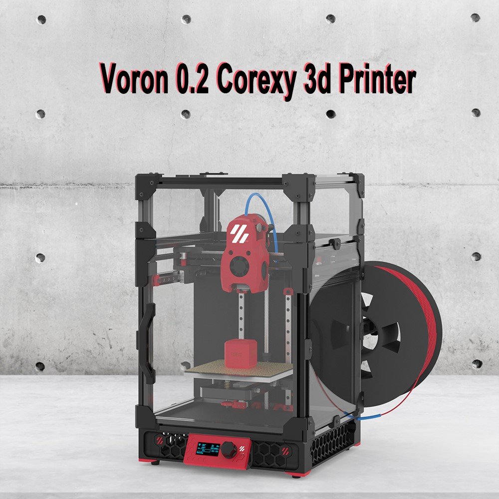

# FYSETC-Voron-0.2-Pro

This is a project from the VORON community, VORON 0.2. We made a little upgrade and improvement on the basis of this project, and provided a complete set of information. Thanks to the open source materials and support provided by the VORON community, and hope you like it. You can find Voron official information below.

1.VORON 0.2 Official website：https://vorondesign.com/voron0.2

2.VORON 0.2 Official Github：https://github.com/VoronDesign/Voron-0

## 1. Kit advantages:

1.VORON 0 1.3-inch OLED display

2.One-piece CNC hotbed holder 

3.Tophat cover (you can lift the top cover at any time for more convenient maintenance)

4.Sensorless Homing 

5.Upgrade MINI Stealthburner head

6.CNC Lightweight Gantry

7.Print surface: high-quality powder PEI steel plate, good adhesion, flexibility, easy to take molds; platform: MIC6 aluminum finishing, flatness up to 0.05, attached to high-temperature soft magnetic, and additionally designed positioning pillars, which can be fast Place the steel plate in place and not easily move.

8.Sailfish High Flow Hotend（24V 60W）

9.Provide a complete set of crimped terminal Teflon wires, suitable in length, plug and play, and easy to use.

10.It adopts high-precision Stainless steel 440c linear guide MGN7H Z1, precise position and stable operation.

11.Imported silicone thermal mattress, high temperature resistance, built-in over-temperature fuse, high power 24V 75W, fast heating.

12.High-quality motors.

13.Sherpa nano-coating one-piece helical gear kit 

14.Use Klipper firmware
Running on CATALYST V2.0 Motherboard +CM68 Linux core board (based on RK3568, 2GB+32GB) +M36 HUB V1.1 , it can achieve higher printing speed, provide Web control (via WiFi or Ethernet), can connect to a camera.

15.VORON 0 LED light 

## 2. Details

[Voron 0.2 Pro](https://github.com/FYSETC/FYSETC-Voron-0.2/blob/main/0.2/README.md)

[Voron 0.2 R1 Pro](https://github.com/FYSETC/FYSETC-Voron-0.2/blob/main/0.2%20R1/README.md)

[Voron 0.2 R1 Pro V1.1](https://github.com/FYSETC/FYSETC-Voron-0.2-Pro/tree/main/0.2%20R1%20V1.1/README.md)

## 3. Community

[Voron community](https://discord.gg/voron)

[FYSETC Facebook group](https://www.facebook.com/groups/238970713918171)

## 4. Buy link

[Aliexpress](https://www.aliexpress.com/item/3256805648574097.html)
